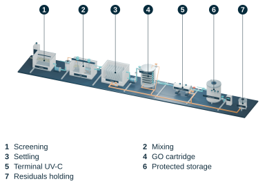
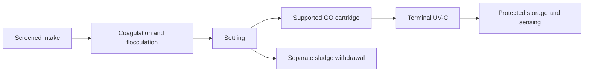
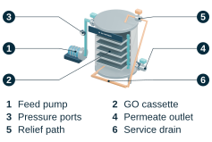
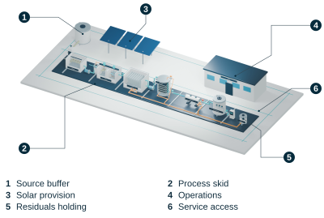
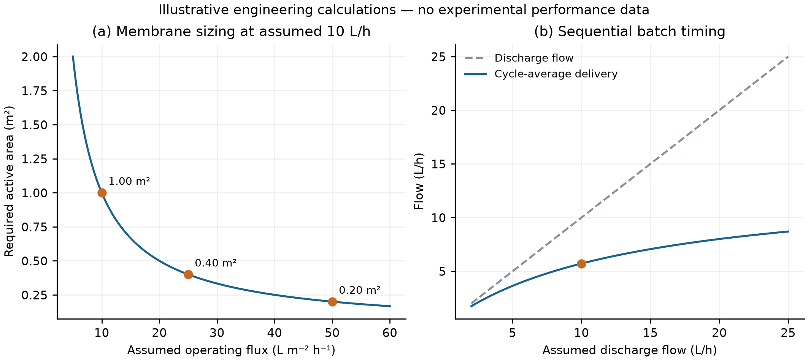

<div align="center">


**Stakeholder Perceptions and a Preliminary Design-and-Engineering Assessment for Floodwater Treatment**

**Sabik Bin Sultan¹ · Shafi Bin Sultan²**  
¹ Bangladesh Air Force Shaheen College Kurmitola · ² St. Joseph Higher Secondary School

[Read the paper](manuscript/BLUESHIELD_FILTER.pdf) · [Explore the models](docs/MODEL_GALLERY.md) · [Reproduce the calculations](docs/CALCULATIONS.md) · [Study scope](docs/STUDY_SCOPE.md)

<a href="manuscript/latex/editable_figure_labels/07_Integrated_Machine.svg"></a>

*The integrated treatment concept. This is a design illustration, not a photograph of a working prototype.*

</div>

## The project

BLUESHIELD FILTER investigates stakeholder perceptions of a proposed floodwater-treatment system and develops a preliminary engineering assessment of its components. The concept combines screened intake, coagulation and flocculation, settling, supported graphene oxide separation, terminal UV-C treatment and protected storage.

This repository brings together the **14-page manuscript**, reported aggregate inputs, reproducible calculations, **eight editable Blender scenes**, publication figures and blank records for future laboratory work.

> **Research stage:** the supplied study does not establish treatment-removal efficiency, potability, validated UV dose, operating cost or household adoption. Engineering examples use explicit assumptions; models communicate design intent.

## Start here

| If you want to… | Open |
|---|---|
| Read the research and its limitations | [Manuscript PDF](manuscript/BLUESHIELD_FILTER.pdf) and [study scope](docs/STUDY_SCOPE.md) |
| Understand the proposed equipment | [Visual model gallery](docs/MODEL_GALLERY.md) and [Blender guide](models/README.md) |
| Inspect the arithmetic and assumptions | [Calculation guide](docs/CALCULATIONS.md), [engineering inputs](data/engineering_inputs.json) and [results](results/engineering_results.json) |
| Trace the reported survey summaries | [Data dictionary](docs/DATA_DICTIONARY.md) and [aggregate audit](results/survey_audit.json) |
| Plan future measurements | [Testing guide](docs/TESTING.md) and [blank laboratory sheets](docs/templates/) |

## The proposed treatment sequence



| Stage | Role in the concept |
|---|---|
| Screened intake | Admit feedwater and intercept coarse debris |
| Coagulation and flocculation | Provide controlled dosing and mixing before settling |
| Settling and sludge withdrawal | Separate settled solids and route residuals separately |
| Supported graphene oxide cartridge | Explore a supported separation stage with material, pressure and stability questions still to resolve |
| Terminal UV-C reactor | Explore a final irradiation stage whose delivered exposure requires optical and hydraulic assessment |
| Protected storage and sensing | Illustrate storage, monitoring and process supervision |

The stage names describe the proposed arrangement. They do not provide validated operating settings or demonstrate water safety. [The manuscript](manuscript/BLUESHIELD_FILTER.pdf) and [study scope](docs/STUDY_SCOPE.md) explain the engineering questions.

## Explore the concept models

| Supported GO cartridge | Installation concept |
|:---:|:---:|
| [](manuscript/latex/editable_figure_labels/04_Supported_GO_Cartridge.svg) | [](manuscript/latex/editable_figure_labels/08_Industrial_Installation.svg) |

The [complete gallery](docs/MODEL_GALLERY.md) covers six stages, the integrated machine and the installation. Each view links to its editable `.blend` scene and original render. These are conceptual models, not fabrication drawings, flow simulations or optical simulations.

The public scene copies use Blender's built-in font instead of packed proprietary font binaries. Geometry and archived publication figures are preserved; newly rendered lettering can differ. See the [model provenance and reproduction notes](models/README.md).

## What the evidence supports

| Material | Available here | Limits |
|---|---|---|
| Stakeholder survey | Reported aggregate summaries for **125 participants** | Respondent-level records, complete questionnaire and recruitment records are unavailable |
| Professional interviews | Reported concern counts for a **25-person component** | Transcripts and coding records are unavailable; categories may overlap |
| Engineering assessment | **Nine equation groups** with explicit assumptions | Conditional sizing, timing, exposure and energy examples; not measured BLUESHIELD performance |
| Software verification | **41 tests** and **10 deterministic result files** | Checks arithmetic, units, invalid inputs and exclusions; does not validate the treatment system |
| Future experiments | **Seven blank laboratory record sheets** | No experimental results are supplied |

Favorable survey ratings describe perceptions, not treatment outcomes. The unresolved **impact-item discrepancy is retained and excluded from interpretation**. No respondent records or replacement percentages have been reconstructed. Read the [evidence status](docs/STUDY_SCOPE.md) before reusing the summaries.

## Reproduce the calculations

Use **Python 3.11 or newer**. The core workflow needs only Python's standard library.

```console
git clone https://github.com/reploymenter/blueshield.git
cd blueshield
python -m unittest discover -s tests -v
python scripts/reproduce.py --output-dir build/reproduced --no-plots --check
python scripts/verify_repository.py
```

The `--check` option compares regenerated numerical outputs with the committed results. Writing into `build/reproduced` preserves the original release record in `results/`.

To also regenerate the two supporting PNG charts:

```console
python -m pip install -r requirements-plots.txt
python scripts/reproduce.py --output-dir build/reproduced --check
```

The [GitHub workflow](https://github.com/reploymenter/blueshield/actions/workflows/reproduce.yml) runs tests, numerical reproduction and file verification on Windows and Ubuntu with Python 3.11, 3.12 and 3.13. Local checks passed on **Python 3.12.14 and 3.13.5**. Consult the workflow for current remote results and [the archived validation record](validation/LOCAL_VALIDATION.md) for manuscript and model checks from package preparation.

### One illustrative calculation

A **20 L** input batch with a **90%** recoverable fraction gives **18 L**. With **81 minutes** of pretreatment and discharge at **10 L/h**, the cycle takes **3.15 hours**, giving **5.71 L/h** averaged over the full cycle.

These are assumed inputs and a timing calculation, not measured device throughput. Changing the discharge rate does not remove pretreatment time.



The [calculation guide](docs/CALCULATIONS.md) traces the formulas, units and distinctions between assumed quantities and unavailable measurements.

## Repository map

| Location | Contents |
|---|---|
| [`manuscript/`](manuscript/README.md) | Final PDF, unchanged LaTeX source, 28 figures, provenance and rebuild instructions |
| [`data/`](docs/DATA_DICTIONARY.md) | Reported aggregate inputs and explicit engineering assumptions |
| [`src/`](src/blueshield/) | Reusable engineering and survey-audit functions |
| [`scripts/`](scripts/) · [`tests/`](tests/) | Reproduction, verification, optional manuscript build and software tests |
| [`results/`](results/) | Inspectable numerical outputs and supporting charts |
| [`models/`](models/README.md) | Eight native Blender scenes, renders and figure-production tools |
| [`docs/`](docs/) | Methods, scope, visual gallery, testing guide and blank records |
| [`validation/`](validation/LOCAL_VALIDATION.md) | Recorded checks and release integrity manifest |

## Paper, citation and reuse

The manuscript retains author order **Sabik Bin Sultan, then Shafi Bin Sultan**. BINAVO LABS is its masthead; the supplied document is a research manuscript, not an IEEE-published article. The [manuscript guide](manuscript/README.md) explains how to obtain the external template dependencies and rebuild its layout without overwriting the archived PDF.

Use [CITATION.cff](CITATION.cff) for the research-companion metadata. No DOI or publication acceptance is asserted. Original software contributions by **Sabik Bin Sultan** are licensed under the [MIT License](LICENSE.md), copyright (c) 2026 Sabik Bin Sultan. The [licensing scope](LICENSING.md) identifies the covered code; the manuscript, data, figures and models retain their existing rights. Coauthor rights and the third-party terms in [THIRD_PARTY_NOTICES.md](THIRD_PARTY_NOTICES.md) remain unchanged.

For later updates, follow [repository maintenance](docs/GITHUB_UPLOAD.md), keep aggregate inputs separate from future measurements, and record each substantive amendment with its source and date.
