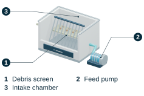
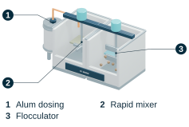
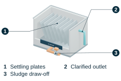
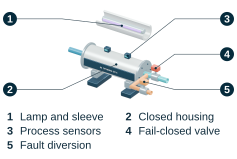
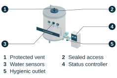

# BLUESHIELD model gallery

[Project overview](../README.md) / [Model files and reproduction guide](../models/README.md) / [Manuscript](../manuscript/BLUESHIELD_FILTER.pdf)

Explore the six proposed treatment stages, connected machine, and installation layout through the **eight original labeled publication figures**. Each plate links to its editable SVG, original transparent render, and sanitized editable Blender scene.

These are explanatory concepts. They do not establish fabrication dimensions, structural suitability, fluid or optical simulation results, or validated treatment performance. Read the [study scope](STUDY_SCOPE.md) alongside the figures.

The displayed SVGs and archived raster renders preserve the supplied publication appearance. The eight public scene files were sanitized to remove packed proprietary font software and use Blender's built-in Bfont instead. Geometry and placement are preserved according to the supplied sanitization records, but a new render may differ in text appearance and pixels. This gallery reuses existing assets; it does not claim a new Blender render or a fresh native-scene validation. See the [model provenance and font notes](../models/README.md#files-and-provenance).

## Browse the stages

[01 Intake and screen](#01---intake-and-screen) | [02 Coagulation and flocculation](#02---coagulation-and-flocculation) | [03 Settling and sludge](#03---settling-and-sludge) | [04 Supported graphene-oxide cartridge](#04---supported-graphene-oxide-cartridge) | [05 Terminal UV-C reactor](#05---terminal-uv-c-reactor) | [06 Protected storage and sensing](#06---protected-storage-and-sensing) | [07 Integrated machine](#07---integrated-machine) | [08 Industrial installation](#08---industrial-installation)

## 01 - Intake and screen

Screened intake and feed pump introduce the proposed treatment train.

[Editable labeled SVG](../manuscript/latex/editable_figure_labels/01_Intake_and_Screen.svg) | [Original render](../models/renders/archive/01_Intake_and_Screen_clean.png) | [Publication PDF](../manuscript/latex/figures/01_Intake_and_Screen.pdf) | [Editable Blender scene](../models/scenes/01_Intake_and_Screen_clean.blend)

## 02 - Coagulation and flocculation

Alum dosing, rapid mixing, and flocculation are arranged as distinct process steps.

[Editable labeled SVG](../manuscript/latex/editable_figure_labels/02_Coagulation_and_Flocculation.svg) | [Original render](../models/renders/archive/02_Coagulation_and_Flocculation_clean.png) | [Publication PDF](../manuscript/latex/figures/02_Coagulation_and_Flocculation.pdf) | [Editable Blender scene](../models/scenes/02_Coagulation_and_Flocculation_clean.blend)

## 03 - Settling and sludge

Settling plates, a clarified outlet, and a separate sludge draw-off show the intended separation paths.

[Editable labeled SVG](../manuscript/latex/editable_figure_labels/03_Settling_and_Sludge.svg) | [Original render](../models/renders/archive/03_Settling_and_Sludge_clean.png) | [Publication PDF](../manuscript/latex/figures/03_Settling_and_Sludge.pdf) | [Editable Blender scene](../models/scenes/03_Settling_and_Sludge_clean.blend)

## 04 - Supported graphene-oxide cartridge

A cutaway explains the supported, immobilized graphene-oxide cassette and its surrounding process connections.

[Editable labeled SVG](../manuscript/latex/editable_figure_labels/04_Supported_GO_Cartridge.svg) | [Original render](../models/renders/archive/04_Supported_GO_Cartridge_clean.png) | [Publication PDF](../manuscript/latex/figures/04_Supported_GO_Cartridge.pdf) | [Editable Blender scene](../models/scenes/04_Supported_GO_Cartridge_clean.blend)

## 05 - Terminal UV-C reactor

The closed reactor concept combines the lamp and sleeve, process sensors, a fail-closed valve, and fault diversion.

[Editable labeled SVG](../manuscript/latex/editable_figure_labels/05_Terminal_UVC_Reactor.svg) | [Original render](../models/renders/archive/05_Terminal_UVC_Reactor_clean.png) | [Publication PDF](../manuscript/latex/figures/05_Terminal_UVC_Reactor.pdf) | [Editable Blender scene](../models/scenes/05_Terminal_UVC_Reactor_clean.blend)

## 06 - Protected storage and sensing

The final storage and sensing arrangement illustrates the proposed downstream handling stage.

[Editable labeled SVG](../manuscript/latex/editable_figure_labels/06_Protected_Storage_and_Sensing.svg) | [Original render](../models/renders/archive/06_Protected_Storage_and_Sensing_clean.png) | [Publication PDF](../manuscript/latex/figures/06_Protected_Storage_and_Sensing.pdf) | [Editable Blender scene](../models/scenes/06_Protected_Storage_and_Sensing_clean.blend)

## 07 - Integrated machine

The connected treatment skid brings the stages together with pressure-control provisions and a divert path.

[Editable labeled SVG](../manuscript/latex/editable_figure_labels/07_Integrated_Machine.svg) | [Original render](../models/renders/archive/07_Integrated_Machine_clean.png) | [Publication PDF](../manuscript/latex/figures/07_Integrated_Machine.pdf) | [Editable Blender scene](../models/scenes/07_Integrated_Machine_clean.blend)

## 08 - Industrial installation

The installation concept places the system within an operations area with service access.

[Editable labeled SVG](../manuscript/latex/editable_figure_labels/08_Industrial_Installation.svg) | [Original render](../models/renders/archive/08_Industrial_Installation_clean.png) | [Publication PDF](../manuscript/latex/figures/08_Industrial_Installation.pdf) | [Editable Blender scene](../models/scenes/08_Industrial_Installation_clean.blend)

## Work with the source models

Open the scene files with Blender 4.3 or later. Follow the [model reproduction guide](../models/README.md) to inspect the scenes, regenerate flat labels from archived renders, or prepare new renders after design edits. Keep generated work separate from the preserved publication assets until it has been reviewed.
